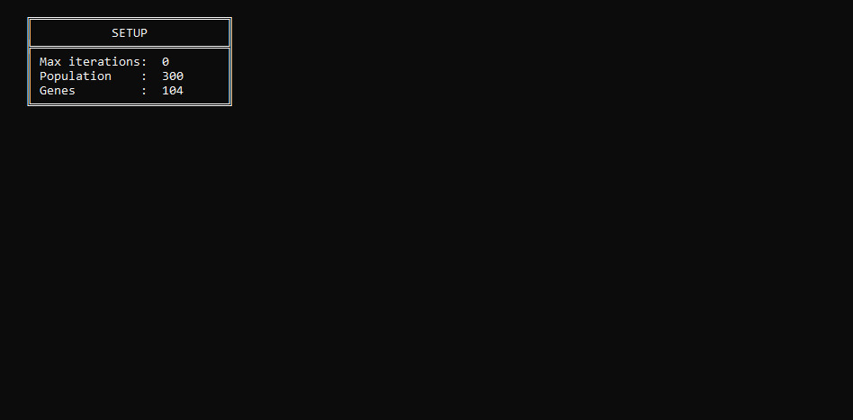

# Simple genetic algorithm

SimpleGeneticAlgorithm is an implementation of a genetic algorithm in C#. Genetic algorithms are inspired by the process of natural selection, where the fittest individuals are selected for reproduction to produce the offspring of the next generation. This project aims to provide a simple, yet efficient example of how a genetic algorithm might be applied.

## Table of Contents

1. [Features](#Features)
4. [Example](#Example)

## Features

- Implementation of genetic algorithm operations including selection, crossover (recombination), and mutation.
- Made with C# making it powerful, yet easy to understand and use.
- Detailed example showing the practical application of the algorithm.
- Dynamic visualisation of the algorithm's process.

## Example

In the `Example` directory, there's a detailed sample application of the genetic algorithm. It demonstrates the workings of the algorithm in an understandable and visual manner.

There's also a visualization that showcases how the algorithm functions. You can see it below:

This image demonstrates the algorithm's progression and how it finds solutions over time.
